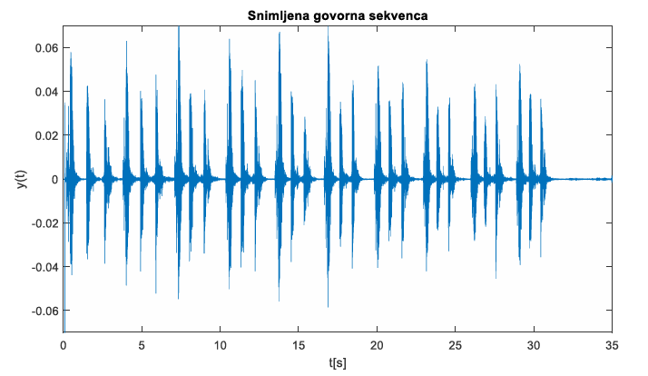
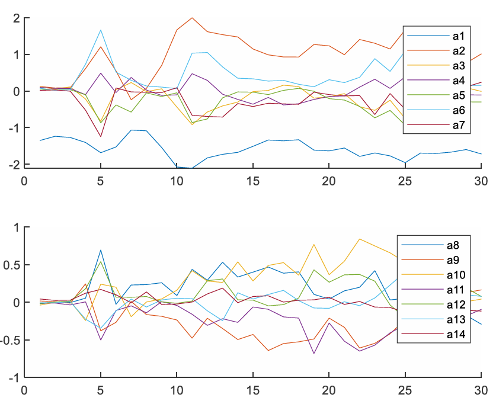
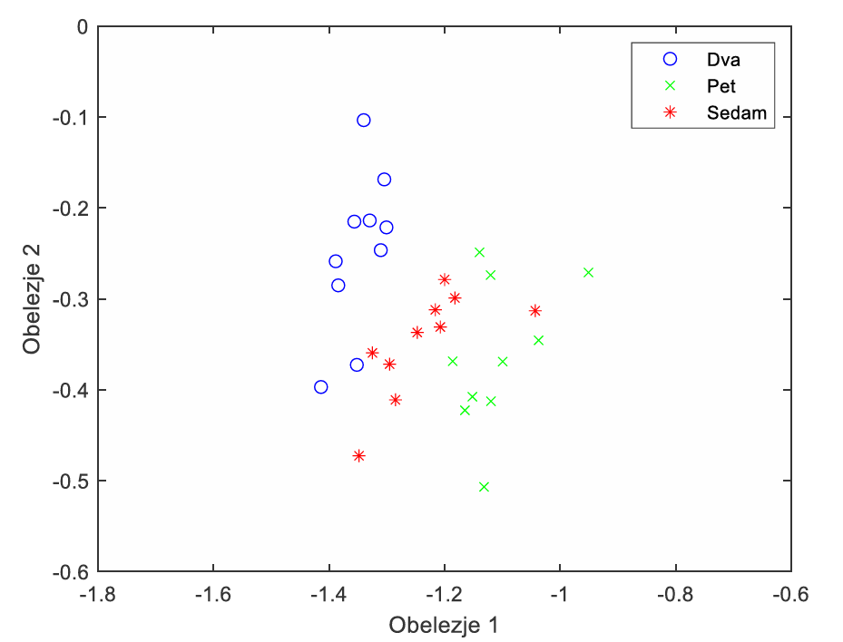
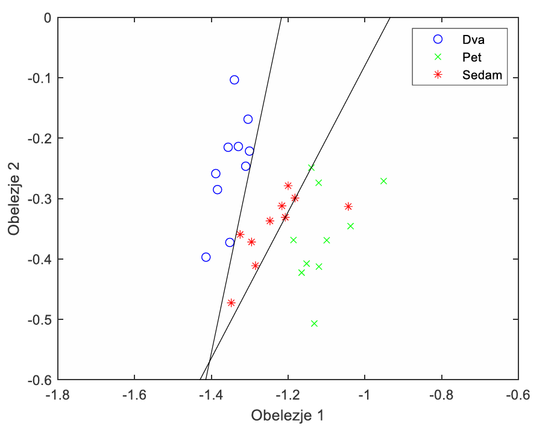
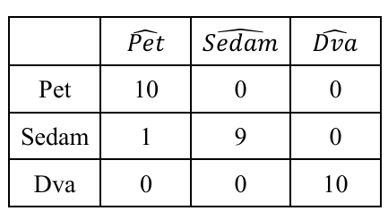

# speech-based-number-classification

## Overview

This project implements a machine learning pipeline for classifying spoken numbers from audio recordings. Given a short speech clip containing a number (0–9), the model predicts the corresponding numeric label.

This type of project is commonly used in speech recognition, digit recognition, and voice-controlled systems.

## Motivation

Automatic number recognition from speech is useful for:

- voice-controlled interfaces (keypad-free input)

- educational tools and games

- automated data entry in call centers

- research in audio signal processing

Traditional speech recognition systems are complex; this project explores a simplified, targeted classification approach using ML techniques.

## Approach

#### 1. Data Collection

- Recordings of numbers (0–9) by different speakers

- Stored as WAV/MP3 files with correct numeric labels

#### 2. Preprocessing

- Audio normalization and noise reduction

- Resampling to a consistent sampling rate

- Feature extraction

#### 3. Model Training

- Optimal Linear Classifier

- Training on extracted features

#### 4. Evaluation

- Metrics: Accuracy, Confusion Matrix

- Analysis of misclassified digits

- Visualizations of feature distributions

## Limitations

- Performance depends on dataset size and speaker diversity

- Background noise can reduce accuracy

- Models may overfit to specific speakers if data is limited

## Future Work

- Use data augmentation (noise, pitch shift, speed changes)

- Experiment with attention-based architectures for better temporal modeling

- Deploy a real-time number recognition web app or desktop interface

- Compare feature-based vs end-to-end deep learning approaches
